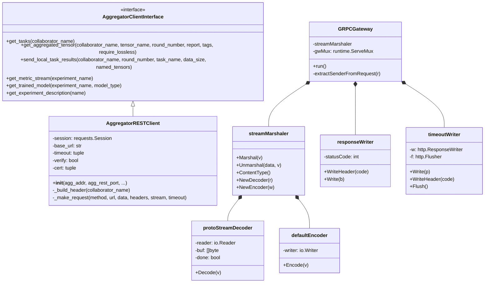
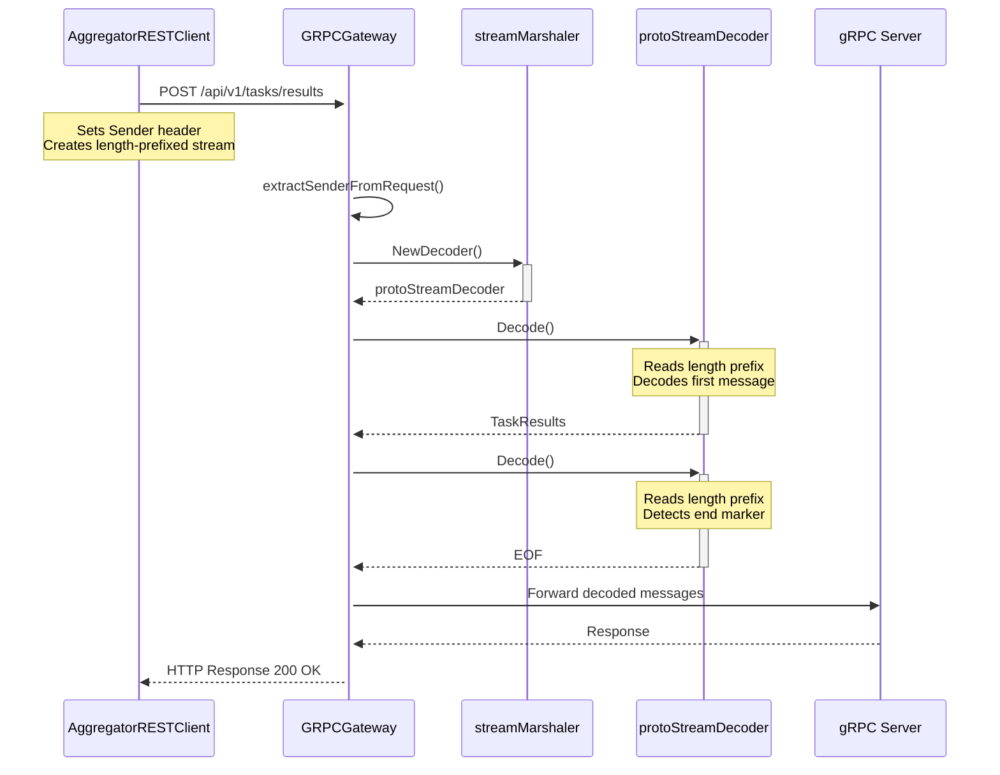
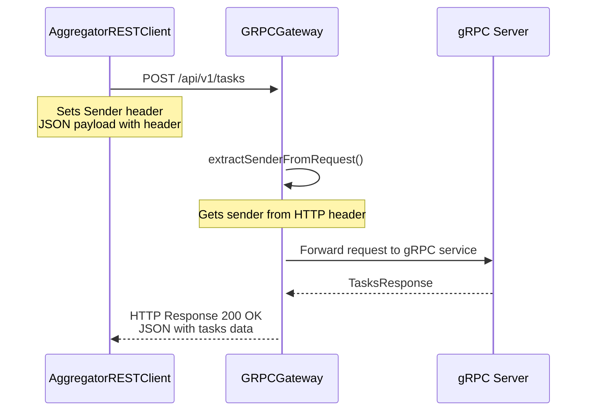

# REST API Design Proposal for OpenFL

## Overview
This document outlines the design of the REST API gateway for OpenFL's federated learning system. The gateway serves as a bridge between HTTP/REST clients and the gRPC-based aggregator service.

## Design Goals
- Enable HTTP/REST access to OpenFL's gRPC services
- Support both streaming and non-streaming operations
- Maintain client identity across requests
- Ensure efficient handling of large payloads
- Provide clear error reporting and logging

## API Endpoints

### Base Path
Define same base path for all APIs using Google API HTTP annotations in proto files:
```protobuf
syntax = "proto3";
package openfl.aggregator;
option go_package = "github.com/ishaileshpant/openfl-grpc-gateway/openfl/protocols";

import "google/api/annotations.proto";

service Aggregator {
  // Get tasks with custom URL
  rpc GetTasks(GetTasksRequest) returns (GetTasksResponse) {
    option (google.api.http) = {
      post: "/api/v1/tasks"
      body: "*"
    };
  }

  // Send local task results with custom URL
  rpc SendLocalTaskResults(stream TaskResults) returns (Empty) {
    option (google.api.http) = {
      post: "/api/v1/tasks/results"
      body: "*"
    };
  }

  // Get aggregated tensor with custom URL
  rpc GetAggregatedTensor(GetAggregatedTensorRequest) returns (GetAggregatedTensorResponse) {
    option (google.api.http) = {
      post: "/api/v1/tensors/{tensor_name}"
      body: "*"
    };
  }

  // Get metric stream with custom URL
  rpc GetMetricStream(GetMetricStreamRequest) returns (stream GetMetricStreamResponse) {
    option (google.api.http) = {
      get: "/api/v1/metrics/{experiment_name}/stream"
    };
  }

  // Get trained model with custom URL
  rpc GetTrainedModel(GetTrainedModelRequest) returns (TrainedModelResponse) {
    option (google.api.http) = {
      get: "/api/v1/models/{experiment_name}"
    };
  }

  // Get experiment description with custom URL
  rpc GetExperimentDescription(GetExperimentDescriptionRequest) returns (GetExperimentDescriptionResponse) {
    option (google.api.http) = {
      get: "/api/v1/experiments/{name}"
    };
  }
}
```

This results in cleaner, RESTful URLs:
```
POST    /api/v1/tasks                          - Get tasks
POST   /api/v1/tasks/results                  - Send task results
POST   /api/v1/tensors/{tensor_name}          - Get aggregated tensor
GET    /api/v1/metrics/{experiment_name}/stream - Get metric stream
GET    /api/v1/models/{experiment_name}       - Get trained model
GET    /api/v1/experiments/{name}             - Get experiment description
```

### URL Mapping Features

1. **Path Variables**
   - Support for URL parameters (e.g., `{tensor_name}`, `{experiment_name}`)
   - Automatic binding to request message fields
   - Type validation and conversion

2. **HTTP Method Mapping**
   - POST for operations with request bodies
   - GET for retrieval operations
   - Support for PUT, PATCH, DELETE if needed

3. **Query Parameters**
   ```protobuf
   option (google.api.http) = {
     get: "/api/v1/tensors/{tensor_name}"
     response_body: "tensor"
     additional_bindings {
       get: "/api/v1/tensors/{tensor_name}/metadata"
       response_body: "metadata"
     }
   };
   ```

4. **Multiple Bindings**
   - Support for multiple HTTP mappings per RPC
   - Different URL patterns for the same operation
   - Varied response formats

5. **Body Mapping**
   ```protobuf
   option (google.api.http) = {
     post: "/api/v1/tasks/results"
     body: "results"  // Maps specific field instead of entire message
   };
   ```

### Implementation Requirements

1. **Proto File Updates**
   ```protobuf
   import "google/api/annotations.proto";
   import "google/api/http.proto";
   ```

2. **Build Configuration**
   ```sh
   protoc -I . \
     --grpc-gateway_out . \
     --grpc-gateway_opt paths=source_relative \
     --grpc-gateway_opt generate_unbound_methods=true \
     your_service.proto
   ```

3. **Gateway Configuration**
   ```go
   mux := runtime.NewServeMux(
     runtime.WithMarshalerOption(runtime.MIMEWildcard, &runtime.JSONPb{
       MarshalOptions: protojson.MarshalOptions{
         UseProtoNames:   true,
         EmitUnpopulated: true,
       },
     }),
   )
   ```

### Benefits
1. More intuitive RESTful URLs
2. Better API documentation
3. Easier integration with existing REST tools
4. Support for URL parameters and query strings
5. Flexible response formatting

### Migration Considerations
1. Update client configurations to use new URLs
2. Maintain backwards compatibility during transition
3. Update API documentation and Swagger specs
4. Test all URL patterns thoroughly

## Design Goals
- Enable HTTP/REST access to OpenFL's gRPC services
- Support both streaming and non-streaming operations
- Maintain client identity across requests
- Ensure efficient handling of large payloads
- Provide clear error reporting and logging

## API Endpoints

### Endpoints

#### 1. Get Tasks
- **Path**: `/api/v1/tasks`
- **Method**: POST
- **Note**: While this is a retrieval operation, POST is used instead of GET because:
  - The request requires a body with federation identity information
  - GET requests shouldn't have request bodies according to HTTP standards
  - The operation involves federation verification beyond simple data retrieval
- **Headers**:
  - `Accept: application/json`
  - `Sender: <collaborator_name>` 
- **Request Body**:
  ```json
  {
    "header": {
      "sender": "<collaborator_name>",
      "receiver": "<aggregator_uuid>",
      "federation_uuid": "<federation_uuid>",
      "single_col_cert_common_name": "<cert_name>"
    }
  }
  ```
- **Response**: JSON containing tasks, round number, sleep time, and quit flag
- **Example Response**:
  ```json
  {
    "tasks": ["task1", "task2"],
    "round_number": 1,
    "sleep_time": 10,
    "quit": false
  }
  ```

#### 2. Send Local Task Results
- **Path**: `/api/v1/tasks/results`
- **Method**: POST
- **Headers**:
  - `Content-Type: application/x-protobuf-stream`
  - `Sender: <collaborator_name>`
- **Request Body**: Length-prefixed protobuf stream
  - Format: `[4-byte length][message bytes][4-byte length][message bytes]`
  - First message: TaskResults data
  - Second message: Empty message (signals end of stream)
- **Response**: Empty response with status code 200

#### 3. Get Aggregated Tensor
- **Path**: `/api/v1/tensors/{tensor_name}`
- **Method**: POST
- **Headers**:
  - `Accept: application/json`
  - `Sender: <collaborator_name>`
- **URL Parameters**:
  - `tensor_name`: Name of the tensor to retrieve
- **Request Body**:
  ```json
  {
    "header": {
      "sender": "<collaborator_name>",
      "receiver": "<aggregator_uuid>"
    },
    "round_number": 1,
    "report": false,
    "tags": ["tag1", "tag2"],
    "require_lossless": true
  }
  ```
- **Response**: JSON containing tensor data

#### 4. Get Metric Stream
- **Path**: `/api/v1/metrics/{experiment_name}/stream`
- **Method**: GET
- **Headers**:
  - `Sender: metric_stream_client`
- **URL Parameters**:
  - `experiment_name`: Name of the experiment
- **Response**: Line-delimited JSON stream of metrics
- **Example Response Line**:
  ```json
  {"metric": "accuracy", "value": 0.95, "timestamp": "2024-03-06T12:00:00Z"}
  ```

#### 5. Get Trained Model
- **Path**: `/api/v1/models/{experiment_name}`
- **Method**: GET
- **Headers**:
  - `Accept: application/json`
  - `Sender: model_client`
- **URL Parameters**:
  - `experiment_name`: Name of the experiment
- **Query Parameters**:
  - `model_type`: Type of model to retrieve (integer)
- **Response**: JSON containing model data

#### 6. Get Experiment Description
- **Path**: `/api/v1/experiments/{name}`
- **Method**: GET
- **Headers**:
  - `Accept: application/json`
  - `Sender: experiment_client`
- **URL Parameters**:
  - `name`: Name of the experiment
- **Response**: JSON containing experiment description

### Content Types
1. **Regular Requests**
   - Request: `application/json`
   - Response: `application/json` or `application/x-protobuf`

2. **Streaming Requests**
   - Request: `application/x-protobuf-stream`
   - Uses length-prefixed format for message boundaries
   - Empty message signals end of stream

### Length-Prefixed Stream Format
```
[4-byte length][message 1 bytes][4-byte length][message 2 bytes]
```
- Length is big-endian encoded uint32
- Zero length indicates end of stream
- Used for large payloads (e.g., model updates)

## Implementation Details

### Gateway Components

1. **Stream Marshaler**
   - Handles protobuf stream encoding/decoding
   - Manages message boundaries in streams
   - Provides custom decoder for streaming content

2. **Request Processing**
   - Extracts sender from headers
   - Routes requests to appropriate gRPC methods
   - Handles content type negotiation

3. **Error Handling**
   - Provides detailed error messages
   - Includes sender information in logs
   - Maintains connection timeouts

### Client Implementation

1. **Session Management**
   - Maintains persistent HTTP connections
   - Handles retries with backoff
   - Configurable timeouts

2. **Request Headers**
   - Sets appropriate content types
   - Includes sender identification
   - Manages connection keep-alive

3. **Streaming Support**
   - Creates length-prefixed messages
   - Handles large payloads efficiently
   - Signals stream completion

## Security Considerations

1. **TLS Support**
   - Optional TLS encryption
   - Client certificate authentication
   - Custom certificate verification

2. **Identity Verification**
   - Sender validation
   - Federation UUID verification
   - Certificate common name checking

## Monitoring and Logging

1. **Request Logging**
   - Sender identification
   - Request duration
   - Status codes
   - Error details

2. **Performance Metrics**
   - Request latency
   - Payload sizes
   - Connection status

## Future Improvements

1. **Enhanced Streaming**
   - Bidirectional streaming support
   - Chunked transfer encoding
   - WebSocket alternatives

2. **Performance Optimizations**
   - Connection pooling
   - Message compression
   - Batch requests

3. **Monitoring**
   - Prometheus metrics
   - Health checks
   - Detailed diagnostics

## OpenFL gRPC Gateway Service

### Overview
The openfl-grpc-gateway service is a standalone Go application that translates HTTP/REST calls to gRPC calls for the OpenFL aggregator service. It provides a RESTful interface while maintaining the efficiency and type safety of gRPC.

### Service Configuration

#### Command Line Arguments
```
--grpc-server-endpoint  Address of the gRPC server (default: "localhost:54210")
--http-port            HTTP gateway listening address (default: "0.0.0.0:8081")
```

### Key Components

#### 1. Gateway Server
```go
type GRPCGateway struct {
    streamMarshaler *streamMarshaler
    gwMux          *runtime.ServeMux
}
```
- Handles HTTP request routing
- Manages content type negotiation
- Provides Swagger UI for API documentation

#### 2. Connection Management
```go
opts := []grpc.DialOption{
    grpc.WithTransportCredentials(insecure.NewCredentials()),
    grpc.WithKeepaliveParams(keepalive.ClientParameters{
        Time:                30 * time.Second,
        Timeout:             10 * time.Second,
        PermitWithoutStream: true,
    }),
    grpc.WithInitialWindowSize(1024 * 1024 * 2),     // 2MB
    grpc.WithInitialConnWindowSize(1024 * 1024 * 2), // 2MB
    grpc.WithDefaultCallOptions(
        grpc.WaitForReady(true),
        grpc.MaxCallRecvMsgSize(1024*1024*50), // 50MB
        grpc.MaxCallSendMsgSize(1024*1024*50), // 50MB
    ),
}
```
- Configurable connection parameters
- Automatic retry with backoff
- Keepalive management
- Large message support

#### 3. Custom Protocol Handlers

##### Stream Marshaler
```go
type streamMarshaler struct {}

func (m *streamMarshaler) NewDecoder(r io.Reader) runtime.Decoder {
    return &protoStreamDecoder{reader: r}
}
```
- Handles protobuf stream encoding/decoding
- Manages message framing
- Supports length-prefixed format

##### Stream Decoder
```go
type protoStreamDecoder struct {
    reader io.Reader
    buf    []byte
    done   bool
}
```
- Processes length-prefixed messages
- Handles stream termination
- Manages buffer state

### Features

#### 1. Request Processing
- Content type-based routing
- Automatic protobuf marshaling/unmarshaling
- Streaming support for large payloads

#### 2. Response Handling
```go
type responseWriter struct {
    http.ResponseWriter
    statusCode int
}

type timeoutWriter struct {
    w http.ResponseWriter
    f http.Flusher
}
```
- Status code tracking
- Timeout management
- Streaming response support

#### 3. Logging and Monitoring
```go
// Request logging with sender and duration
log.Printf("Request completed: %s %s [%d] from %s in %v", 
    r.Method, r.URL.Path, rw.statusCode, sender, duration)
```
- Request/response logging
- Duration tracking
- Error reporting
- Client identification

### Performance Optimizations

#### 1. Connection Management
- Persistent connections
- Connection pooling
- Keepalive settings

#### 2. Memory Management
- Buffered reading/writing
- Configurable buffer sizes
- Streaming for large payloads

#### 3. Error Handling
- Automatic retries
- Backoff strategy
- Detailed error reporting

### Swagger Integration

#### 1. Embedded Swagger Files
```go
//go:embed openfl/protocols/base.swagger.json
var baseSwagger []byte

//go:embed openfl/protocols/aggregator.swagger.json
var aggregatorSwagger []byte
```
- Auto-generated from protobuf
- Interactive API documentation
- Built-in testing interface

#### 2. Swagger UI Endpoints
```
/swagger/              - Swagger UI interface
/swagger/base.json     - Base API specification
/swagger/aggregator.json - Aggregator API specification
```

### Security Features

#### 1. TLS Support
- Optional TLS encryption
- Client certificate validation
- Custom certificate handling

#### 2. Request Validation
- Sender verification
- Content type validation
- Message size limits

### Deployment Considerations

#### 1. Resource Requirements
- Memory: 2GB minimum recommended
- CPU: 2 cores minimum recommended
- Network: High bandwidth for large payloads

#### 2. Environment Variables
- None required (all configurable via flags)
- Supports standard Go environment variables

#### 3. Monitoring
- Standard HTTP metrics
- Custom request logging
- Error tracking

## Architecture Diagrams

### Class Diagram
The following diagram shows the key components and their relationships:



### Streaming Request Sequence Diagram
The following diagram shows the flow for sending task results:



### Regular Request Sequence Diagram
The following diagram shows the flow for non-streaming requests:



## References
- [gRPC-Gateway Documentation](https://grpc-ecosystem.github.io/grpc-gateway/)
- [Protocol Buffers](https://developers.google.com/protocol-buffers)
- [HTTP/1.1 Specification](https://tools.ietf.org/html/rfc7231)